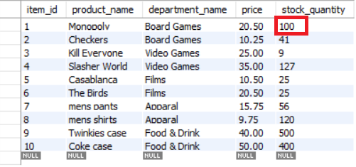
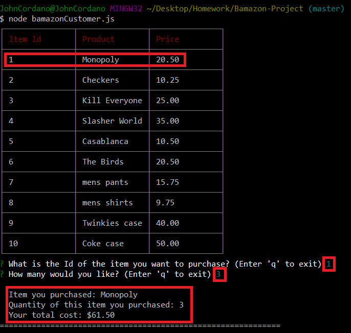
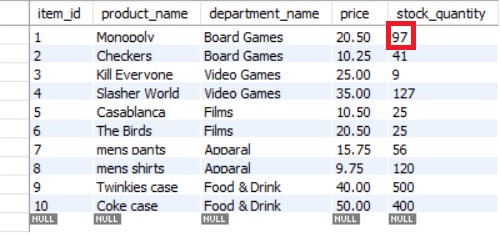
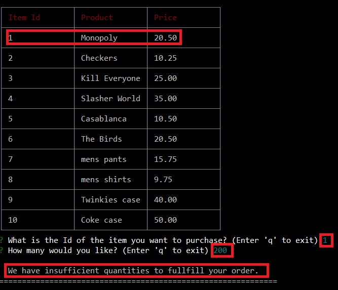
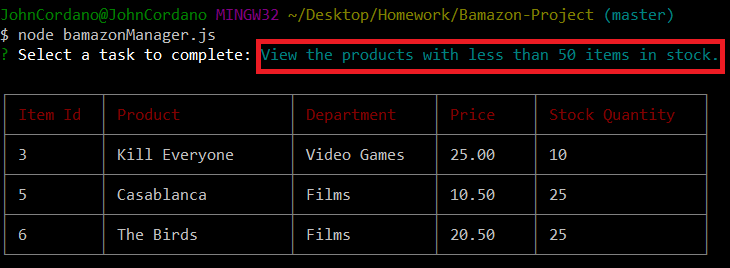
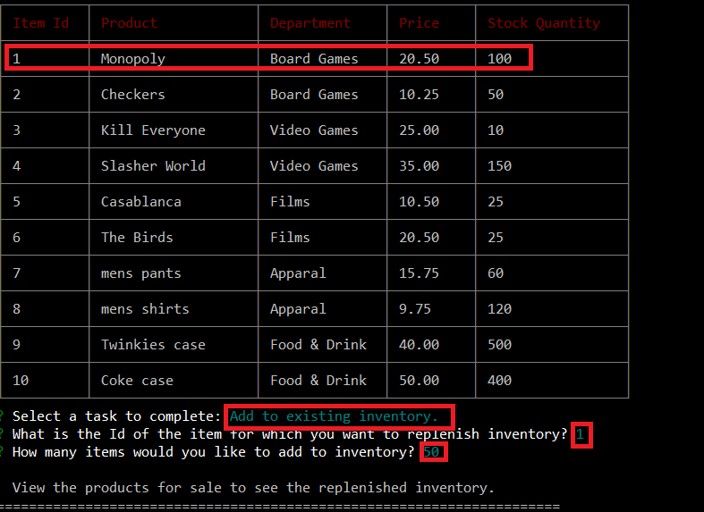
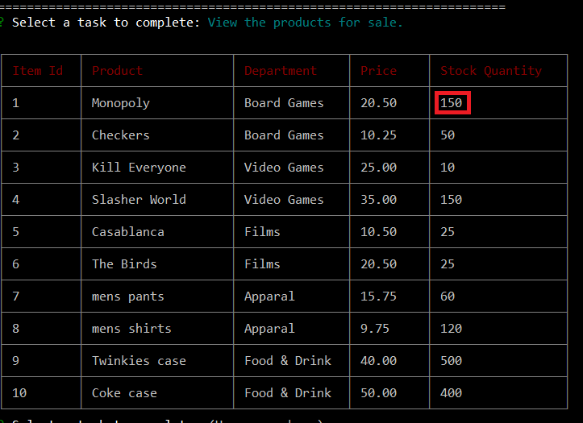
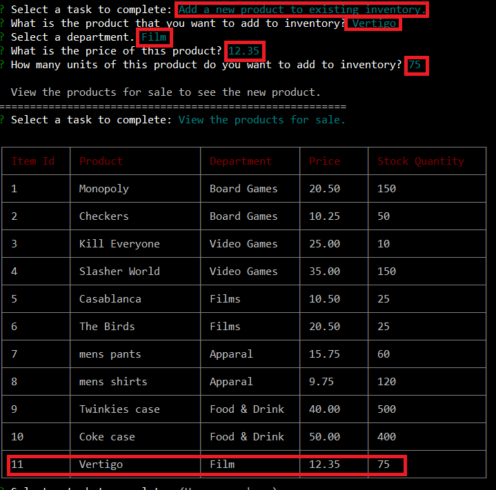

# Bamazon Project

Bamazon is an interactive shopping application that allows a customer to purchase products and a manager to manage products.

# Customer View

The bamazonCustomer.js file controls the customer view. In this view, the customer can see a table of items to purchase, and then enter the Id of an item and the quantity of that item to purchase.  After customer input, the application displays information about the purchase, including its total cost.

The stock quantity of the purchased item is reduced by the customer-purchase quantity. If this stock quantity is less than the customer-purchase quantity, the customer purchase is not completed, and the application displays a message about insufficent quantities available to fulfill the customer order.

After each purchase, the customer is prompted to purchase another item, but the customer can enter 'q' to exit the application at any time.

# Screenshots for Customer View

The following image shows the products table in the bamazon database of MySQL Workbench before customer input. Notice that the Monopoly Game item has a stock quantity of 100.

The following image shows the customer purchasing 3 Monopoly games and information about that purchase, including its total cost.

The following image shows the products table in the bamazon database of MySQL Workbench after customer input. Notice that the Monopoly Game item now has a stock quantity of 97 (100 games less the 3 games that the customer purchased).  

The following image shows the customer attempting to purchase 200 Monopoly games and the message that is displayed about insufficient quantities available to fulfill the customer order.

# Manager View

The bamazonManager.js file controls the manager view. In this view, the manager can complete the following tasks:

	- View the products for sale.
	- View the products with less than 50 items in stock.
	- Add to existing inventory.
	- Add a new product to existing inventory.
	- Exit the application.

 To add to existing inventory, the manager enters the Id of the item and the quantity of that item to add to inventory. The stock quantity of the designated item is increased by the manager-input quantity. After manager input, the application displays a message telling the manager to view the products for sale to see the replenished inventory.

 To add a new product to existing inventory, the manager enters information about the new product, including its name, associated department, price, and stock quantity. After manager input, the application displays a message telling the manager to view the products for sale to see the new product. 

# Screenshots for Manager View

The following image shows the result when the manager elects to view the products with less then 50 items in stock.

The following image shows the manager adding 50 Monoply games. Notice that the products table shows 100 Monopoly games before the manager completes the task.

The following image shows the products table after the manager adds the Monopoly games. Notice that the products table now shows 150 games (100 games plus the 50 games that the manager added).

The following image shows the manager adding the Vertigo film as a new product to existing inventory. Notice that the products table shows this new product after the manager completes the task.

 

# Screenshot for User Input Validation

The application includes user input validation. Consequently, the appropropriate message is displayed if the customer or manager presses a non-number key, such as a letter key, the space bar, the Enter key, or a special character key, for a prompt response that must be a number.

The following image shows the messages that are displayed if the customer presses the 'm' key, the '#' key, and the Enter key when prompted to enter a number (the Id of an item).

# Tools Used

- JavaScript
- node.js
- MySQL
- MySQL Workbench
- npm packages:
	- mysql
	- inquirer
	- cli-table   