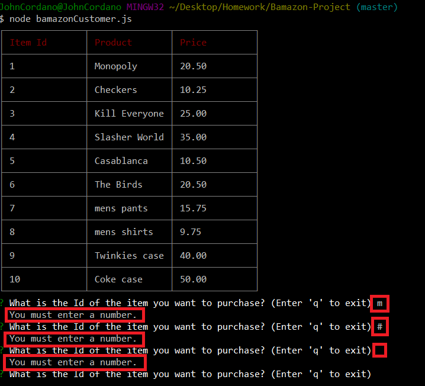

# Bamazon Project

Bamazon is an interactive shopping application that allows the customer to view a table of items to purchase. The customer enters the Id of an item and the quantity of that item to purchase. The application includes customer input validation, which displays the appropropriate message if the customer presses a non-number key, such as a letter key, the space bar, the Enter key, or a special character key. After customer input, the application processes the customer purchase, and displays information about the purchase, including its total cost.

The stock quantity of the purchased item is reduced by the customer-purchase quantity. If this stock quantity is less than the customer-purchase quantity, the customer purchase is not completed, and the application displays a message about insufficent quantities available to fulfill the customer order.

After each purchase, the customer is prompted to purchase another item, but the customer can enter 'q' to exit the application at any time.

# Sample Screenshots

The following image shows the products table in the bamazon database of MySQL Workbench before customer input. Notice that the Monopoly Game item has a stock quantity of 100.

The following image shows the customer purchasing 3 Monopoly games and information about that purchase, including its total cost.

The following image shows the products table in the bamazon database of MySQL Workbench after customer input. Notice that the Monopoly Game item now has a stock quantity of 97 (100 games less the 3 games that the customer purchased).  

The following image shows the customer attempting to purchase 200 Monopoly games and the message that is displayed about insufficient quantities available to fulfill the customer order.

The following image shows the messages that are displayed if the customer presses the 'm' key, the '#' key, and the Enter key when prompted to enter a number (the Id of an item).

The following image shows the message that is displayed if the customer presses the 'q' key to exit the application.

# Tools Used

- JavaScript
- node.js
- MySQL
- MySQL Workbench
- npm packages:
	- mysql
	- inquirer
	- cli-table   